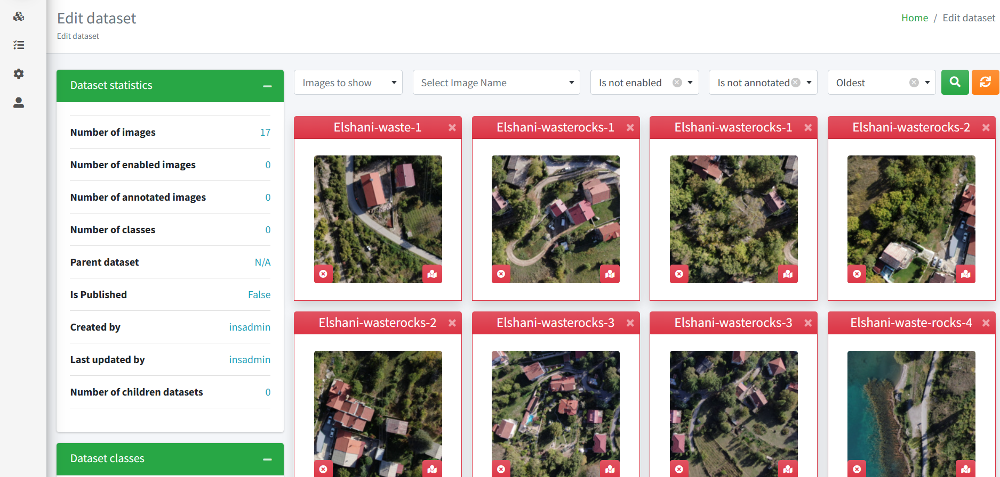

<h1 align="center">
    Illegal Dump Site Detection and Landfill Monitoring   
</h1>

## 🌐 Overview  

Welcome to the Illegal Dump Site Detection and Landfill Monitoring repository.  

This platform leverages advanced drone and satellite imagery to enhance waste management and environmental monitoring through cutting-edge technology.  

Utilizing high-resolution images combined with sophisticated image annotation, object detection models, and geospatial analysis, our system offers robust tools to identify illegal dump sites and effectively manage regulated landfills.  

### 🗝️Key Features  

- #### Dataset Management

  - Manage extensive datasets of drone and satellite images with tools for uploading, categorizing, and maintaining image data.  
  - Features include tagging, filtering, and robust data integrity checks to ensure dataset accuracy and usability for environmental monitoring tasks.

- #### Image Annotation  

  - Annotate high-resolution drone and satellite imagery to help train object detection models specifically designed for precise waste detection.  

- #### Object Detection Model Training  

  - Train sophisticated models with diverse image datasets from drone and satellite sources to enhance detection accuracy across varied environmental conditions.  

- #### Detection and Monitoring  

  - Deploy models, both pre-trained and newly trained, to detect waste sites from aerial perspectives.  
  - Results are displayed on a georeferenced map, providing a clear and actionable visual representation.  

- #### Landfill Management  

  - Advanced tools for managing legal landfills include the submission of waste forms and the integration of 3D point cloud scans derived from drone technology for detailed, real-time monitoring.  

This repository aims to equip researchers, environmental agencies, and policymakers with the tools needed to monitor and respond to environmental challenges efficiently.  

Join us in leveraging these capabilities to maintain ecological integrity and promote sustainable practices in waste management.  

Our complete [Project Charter](https://intelligentnetworksolutions.github.io/IllegalDumpSiteDetectionAndLandfillMonitoring/about/project-charter.html).

 

<table align="center" cellpadding="12" frame="above">
    <tr>
        <td align="center">
            
             
            <i>Dataset Management</i>
        </td>
        <td align="center">
            
             
            <i>Object Detection Raw Output</i>
        </td>
    </tr>
    <tr align="center">
        <td colspan="2" align="center">
            
             
            <i>Object Detection on Large Image Raw Output</i>
             
            <i>Open the image in a new tab and zoom in</i>
        </td>
    </tr>
</table>

## 📝Table of Contents

1. [Overview](#-overview)  
     - [🗝️ Key Features](#%EF%B8%8Fkey-features)  
2. [Main Dependencies](#%EF%B8%8F-main-dependencies)  
3. [Set-up](#-set-up)  
4. [Development](#development)  
    - [🔒 Secrets](#secrets) | [📈Diagrams](#-development-diagrams) | [🔬 Testing](#-testing)  
5. [Licensing](#%EF%B8%8F-licensing)  
    - Apache 2.0  
6. [Acknowledgments](#-acknowledgments)  
    - UNICEF Venture Fund  
7. [Code of Conduct](#-code-of-conduct)  
    - Contributor Covenant  
8. [Contributing](#-contributing)  
    - 📌✅ Issue | 🍴 Fork | 🪢 Pull  
</table>

### 🖇️ Main Dependencies  

<table cellpadding="12" frame="above">
<tr>
<td>

| **MVC App Components**  | **Technology / Tool**    |
|-------------------------|--------------------------|  
| Web Framework           | .NET 8                   |  
| ORM                     | Entity Framework         |  
| Package Manager         | npm                      |  
| Frontend Library        | Open Layers              |  
| Geographic Library      | NetTopologySuite         |  
| Database                | PostgreSQL 16            |  
| Database Extension      | PostGIS                  |  
| GIS Server              | Geoserver                | 

</td>
<td>

| **Object Detection Scripts** | **Environment/Requirements** | **Version** | **Optional** |  
|------------------------------|------------------------------|-------------|--------------|  
| MMDetection                  | Miniconda                    | 3           |              |  
|                              | Python                       | 3.8         |              |  
|                              | C++                          | 14          |              |  
|                              | Pytorch                      | _depends_   | _CUDA_       |  

</td>
</tr>
</table>

## ⛺ Set-up

Please refer to our [Detailed Set-up Instructions](https://intelligentnetworksolutions.github.io/IllegalDumpSiteDetectionAndLandfillMonitoring/development/set-up.html) for installation instructions.

## 👨‍💻Development  

### 🔒Secrets

We use the [dotnet user-secrets tool](https://learn.microsoft.com/en-us/aspnet/core/security/app-secrets?view=aspnetcore-8.0&tabs=windows#secret-manager) to manage our secrets instead of appsettings.json files.  

For a detailed guide on how to implement and manage secrets in your development environment effectively:

- visit our [Secrets Management Guide](https://intelligentnetworksolutions.github.io/IllegalDumpSiteDetectionAndLandfillMonitoring/development/shhh_secrets.html)  
- [dotnet user-secrets tool](https://learn.microsoft.com/en-us/aspnet/core/security/app-secrets?view=aspnetcore-8.0&tabs=windows#secret-manager)  

### 📈 Development Diagrams  

Our project utilizes a series of development diagrams to illustrate the architecture and workflow of the Illegal Dump Site Detection and Landfill Monitoring system.  
These diagrams are essential for developers and contributors to understand the overall structure and interaction of the components within the project.

You can view these diagrams in detail by visiting our [Development Diagrams page](https://intelligentnetworksolutions.github.io/IllegalDumpSiteDetectionAndLandfillMonitoring/diagrams/intro.html).  
Here, you will find visual representations that include system architecture diagrams, data flow diagrams, and other relevant graphical documentation that supports the development and maintenance of the project.

These resources are designed to provide clarity and facilitate a better understanding of the project’s technical framework, helping both new and existing contributors to navigate the project more effectively.  

### 🔬 Testing  

Our project uses XUnit for unit testing to ensure that each component functions correctly and meets the expected behavior.  
Coverlet is integrated for measuring the code coverage, which helps us maintain and improve the quality of our codebase.  

Please refer to our [Testing Information Document](https://intelligentnetworksolutions.github.io/IllegalDumpSiteDetectionAndLandfillMonitoring/development/testing.html) for installation instructions.  

## ⚖️ Licensing  

This project is licensed under the __Apache License 2.0__.  
This license allows for a great deal of freedom in both academic and commercial use of this software.  

For more details, see the [full license text](https://github.com/IntelligentNetworkSolutions/IllegalDumpSiteDetectionAndLandfillMonitoring?tab=Apache-2.0-1-ov-file#readme).  

## 👏 Acknowledgments  

- Sponsor  
  - **UNICEF Venture Fund**  
  
- _We would like to express our profound gratitude to our sponsor, the UNICEF Venture Fund, for their generous support of our project.  
  Their commitment to fostering innovation and their sponsorship of similar projects that utilize frontier technology is truly commendable and instrumental in driving positive change._  

- _Each team member has played a pivotal role in bringing this project to fruition, and we are immensely thankful for their hard work and dedication._  
  
## 🤝 Code of Conduct

We are committed to fostering a welcoming and inclusive community.  
Our project adheres to a Code of Conduct that outlines expectations for participation and community standards for behavior.  
We encourage all contributors and participants to review and adhere to these guidelines.

[Read our full Code of Conduct here.](https://github.com/IntelligentNetworkSolutions/IllegalDumpSiteDetectionAndLandfillMonitoring/blob/master/CODE_OF_CONDUCT.md)  

By participating in this project, you agree to abide by its terms.  

## 📌✅🍴 Contributing

We welcome contributions from the community.  
Whether you're fixing bugs, adding new features, or improving documentation, your help is greatly appreciated.  

For detailed instructions on how to contribute, please see our [contributing guidelines](https://github.com/IntelligentNetworkSolutions/IllegalDumpSiteDetectionAndLandfillMonitoring/blob/master/CONTRIBUTING.md)  .
