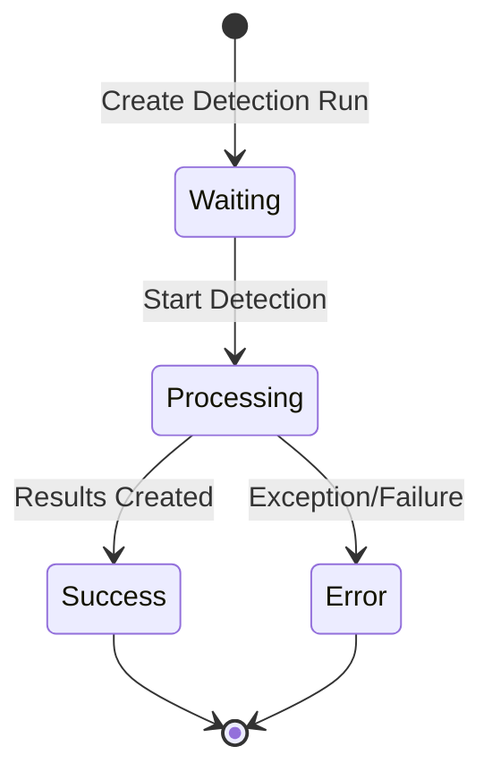

# DetectionRun Service and Controller Documentation

## DetectionRun Entity Overview

### Core Properties

```csharp
public class DetectionRun : BaseEntity<Guid>, ICreatedByUser
{
    public string Name { get; set; }
    public string? Description { get; set; }
    public bool IsCompleted { get; set; } = false;
    public string? Status { get; set; }
    public Guid DetectionInputImageId { get; set; }
    public Guid TrainedModelId { get; set; }
    public string CreatedById { get; set; }
    public DateTime CreatedOn { get; set; }
    public virtual ICollection<DetectedDumpSite>? DetectedDumpSites { get; set; }
}
```

## DetectionRunService Key Methods

### 1. Creating Detection Runs

```csharp
public async Task<ResultDTO> CreateDetectionRun(DetectionRunDTO detectionRunDTO)
{
    try
    {
        DetectionRun detectionRunEntity = _mapper.Map<DetectionRun>(detectionRunDTO);
        ResultDTO<DetectionRun> resultCreate = 
            await _detectionRunRepository.CreateAndReturnEntity(detectionRunEntity);

        if (resultCreate.IsSuccess == false && resultCreate.HandleError())
            return ResultDTO.Fail(resultCreate.ErrMsg!);

        if (resultCreate.Data is null)
            return ResultDTO.Fail("Error Creating Detection Run");

        return ResultDTO.Ok();
    }
    catch (Exception ex)
    {
        _logger.LogError(ex.Message, ex);
        return ResultDTO.ExceptionFail(ex.Message, ex);
    }
}
```

### 2. Starting Detection Process

```csharp
public async Task<ResultDTO> StartDetectionRun(DetectionRunDTO detectionRunDTO)
{
    if (detectionRunDTO is null || detectionRunDTO.TrainedModelId is null)
        return ResultDTO.Fail("Detection Run or Model Id is null");

    // Generate detection command
    string detectionCommand = GeneratePythonDetectionCommandByType(
        imageToRunDetectionOnPath: detectionRunDTO.InputImgPath,
        trainedModelConfigPath: detectionRunDTO.TrainedModel.ModelConfigPath!,
        trainedModelModelPath: detectionRunDTO.TrainedModel.ModelFilePath!,
        detectionRunId: detectionRunDTO.Id!.Value,
        isSmallImage: false,
        hasGPU: false
    );

    // Execute via Conda
    var powerShellResults = await Cli.Wrap(_MMDetectionConfiguration.GetCondaExeAbsPath())
        .WithWorkingDirectory(_MMDetectionConfiguration.GetRootDirAbsPath())
        .WithValidation(CommandResultValidation.None)
        .WithArguments(detectionCommand.ToLower())
        .WithStandardOutputPipe(PipeTarget.ToFile(
            Path.Combine(_MMDetectionConfiguration.GetDetectionRunCliOutDirAbsPath(), 
                        $"succ_{detectionRunDTO.Id.Value}.txt")))
        .WithStandardErrorPipe(PipeTarget.ToFile(
            Path.Combine(_MMDetectionConfiguration.GetDetectionRunCliOutDirAbsPath(), 
                        $"error_{detectionRunDTO.Id.Value}.txt")))
        .ExecuteBufferedAsync();

    return powerShellResults.IsSuccess ? ResultDTO.Ok() : 
           ResultDTO.Fail($"Detection Run failed with error: {powerShellResults.StandardError}");
}
```

### 3. Status Management

```csharp
public async Task<ResultDTO> UpdateStatus(Guid detectionRunId, string status)
{
    try
    {
        ResultDTO<DetectionRun?> resultGetEntity = 
            await _detectionRunRepository.GetById(detectionRunId, track: true);
            
        if (resultGetEntity.IsSuccess == false || resultGetEntity.Data is null)
            return ResultDTO.Fail($"No Detection Run found with ID: {detectionRunId}");

        DetectionRun detectionRunEntity = resultGetEntity.Data!;
        detectionRunEntity.Status = status;

        ResultDTO resultUpdate = await _detectionRunRepository.Update(detectionRunEntity);
        return resultUpdate.IsSuccess ? ResultDTO.Ok() : 
               ResultDTO.Fail(resultUpdate.ErrMsg!);
    }
    catch (Exception ex)
    {
        _logger.LogError(ex.Message, ex);
        return ResultDTO.ExceptionFail(ex.Message, ex);
    }
}
```

### 4. Results Processing

```csharp
public async Task<ResultDTO<List<DetectedDumpSite>>> CreateDetectedDumpsSitesFromDetectionRun(
    Guid detectionRunId, 
    DetectionRunFinishedResponse detectedDumpSitesProjectedResponse)
{
    // Get Detection Run with related data
    ResultDTO<DetectionRun?> getDetectionRunIncluded =
        await _detectionRunRepository.GetByIdIncludeThenAll(detectionRunId, track: false, 
        includeProperties: [
            (dr => dr.TrainedModel!, 
            [tm => ((TrainedModel)tm).Dataset!, 
                d => ((Dataset)d).DatasetClasses, 
                    ddc => ((Dataset_DatasetClass)ddc).DatasetClass])
        ]);

    if (!getDetectionRunIncluded.IsSuccess || getDetectionRunIncluded.Data is null)
        return ResultDTO<List<DetectedDumpSite>>.Fail("Detection Run not found");

    // Create dump sites from detection results
    List<DetectedDumpSiteDTO> detectedDumpSites = new();
    GeometryFactory factory = new();

    for (int i = 0; i < detectedDumpSitesProjectedResponse.bboxes.Length; i++)
    {
        var box = detectedDumpSitesProjectedResponse.bboxes[i];
        // Create polygon from bounding box
        Polygon polygon = CreatePolygonFromBBox(box, factory);
        
        // Add detected dump site
        detectedDumpSites.Add(new DetectedDumpSiteDTO
        {
            DetectionRunId = detectionRunId,
            DatasetClassId = GetDatasetClassId(detectedDumpSitesProjectedResponse.labels[i]),
            ConfidenceRate = detectedDumpSitesProjectedResponse.scores[i],
            Geom = polygon
        });
    }

    // Save to database
    List<DetectedDumpSite> detectedDumpSitesEntities = 
        _mapper.Map<List<DetectedDumpSite>>(detectedDumpSites);
    foreach (var entity in detectedDumpSitesEntities)
    {
        await _detectedDumpSitesRepository.Create(entity);
    }

    return ResultDTO<List<DetectedDumpSite>>.Ok(detectedDumpSitesEntities);
}
```

## DetectionRunsController Endpoints

### 1. Schedule Detection Run

```csharp
[HttpPost]
[HasAuthClaim(nameof(AuthClaims.ScheduleDetectionRun))]
public async Task<ResultDTO> ScheduleDetectionRun(DetectionRunViewModel viewModel)
{
    if (!ModelState.IsValid)
        return ResultDTO.Fail(ModelState.GetErrorMessages());

    string? userId = User.FindFirstValue("UserId");
    if (userId is null)
        return ResultDTO.Fail("User id is null");

    DetectionRunDTO detectionRunDTO = new()
    {
        Id = Guid.NewGuid(),
        Name = viewModel.Name,
        CreatedById = userId,
        Status = nameof(ScheduleRunsStatus.Waiting)
    };

    ResultDTO<DetectionRunDTO> resultCreate = 
        await _detectionRunService.CreateDetectionRun(detectionRunDTO);
    if (!resultCreate.IsSuccess)
        return ResultDTO.Fail(resultCreate.ErrMsg!);

    string jobId = _backgroundJobClient.Enqueue(() => 
        ExecuteDetectionRunProcess(resultCreate.Data));

    using (IStorageConnection? connection = JobStorage.Current.GetConnection())
    {
        connection.SetJobParameter(jobId, "detectionRunId", 
            detectionRunDTO.Id.Value.ToString());
    }

    return ResultDTO.Ok();
}
```

### 2. Execute Detection Process

```csharp
[HttpPost]
[HasAuthClaim(nameof(AuthClaims.ExecuteDetectionRun))]
public async Task<ResultDTO> ExecuteDetectionRunProcess(DetectionRunDTO detectionRunDTO)
{
    try
    {
        // Update status to Processing
        ResultDTO updateStatusResult = await _detectionRunService.UpdateStatus(
            detectionRunDTO.Id!.Value, 
            nameof(ScheduleRunsStatus.Processing)
        );
        if (!updateStatusResult.IsSuccess)
            return await HandleErrorProcess(detectionRunDTO.Id.Value, 
                updateStatusResult.ErrMsg!);

        // Start detection
        ResultDTO startResult = await _detectionRunService.StartDetectionRun(detectionRunDTO);
        if (!startResult.IsSuccess)
            return await HandleErrorProcess(detectionRunDTO.Id.Value, startResult.ErrMsg!);

        // Process results
        ResultDTO<string> resultPathsResult = 
            await _detectionRunService.GetRawDetectionRunResultPathsByRunId(
                detectionRunDTO.Id.Value);
        if (!resultPathsResult.IsSuccess)
            return await HandleErrorProcess(detectionRunDTO.Id.Value, 
                resultPathsResult.ErrMsg!);

        // Create detected dump sites
        ResultDTO<DetectionRunFinishedResponse> bboxResults = 
            await _detectionRunService.GetBBoxResultsDeserialized(
                resultPathsResult.Data!);
        if (!bboxResults.IsSuccess)
            return await HandleErrorProcess(detectionRunDTO.Id.Value, bboxResults.ErrMsg!);

        ResultDTO<List<DetectedDumpSite>> createDumpSitesResult = 
            await _detectionRunService.CreateDetectedDumpsSitesFromDetectionRun(
                detectionRunDTO.Id.Value, 
                bboxResults.Data!);
        if (!createDumpSitesResult.IsSuccess)
            return await HandleErrorProcess(detectionRunDTO.Id.Value, 
                createDumpSitesResult.ErrMsg!);

        // Update status to Success
        await _detectionRunService.UpdateStatus(detectionRunDTO.Id.Value, 
            nameof(ScheduleRunsStatus.Success));

        return ResultDTO.Ok();
    }
    catch (Exception ex)
    {
        return await HandleErrorProcess(detectionRunDTO.Id.Value, ex.Message);
    }
}
```

### 3. Error Handling

```csharp
private async Task<ResultDTO<string>> HandleErrorProcess(Guid detectionRunId, 
    string inputErrMsg)
{
    StringBuilder errMsgBuilder = new();
    errMsgBuilder.AppendLine(inputErrMsg);

    // Update status to Error
    ResultDTO resStatusUpdate = await _detectionRunService.UpdateStatus(
        detectionRunId, 
        nameof(ScheduleRunsStatus.Error)
    );
    if (!resStatusUpdate.IsSuccess)
        errMsgBuilder.AppendLine(resStatusUpdate.ErrMsg!);

    // Create error file
    ResultDTO resultFileCreating = await CreateErrMsgFile(detectionRunId, 
        errMsgBuilder.ToString());
    if (!resultFileCreating.IsSuccess)
        errMsgBuilder.AppendLine(resultFileCreating.ErrMsg!);

    // Mark Hangfire job as failed
    ResultDTO resMarkJobAsFailed = await MarkJobAsFailed(errMsgBuilder.ToString(), 
        detectionRunId);
    if (!resMarkJobAsFailed.IsSuccess)
        errMsgBuilder.AppendLine(resMarkJobAsFailed.ErrMsg!);

    return ResultDTO<string>.Ok(errMsgBuilder.ToString());
}
```

## Status Flow



## Key Interfaces

### IDetectionRunService

```csharp
public interface IDetectionRunService
{
    Task<ResultDTO> CreateDetectionRun(DetectionRunDTO detectionRunDTO);
    Task<ResultDTO> StartDetectionRun(DetectionRunDTO detectionRunDTO);
    Task<ResultDTO> UpdateStatus(Guid detectionRunId, string status);
    Task<ResultDTO<string>> GetRawDetectionRunResultPathsByRunId(Guid detectionRunId);
    Task<ResultDTO<DetectionRunFinishedResponse>> GetBBoxResultsDeserialized(
        string absBBoxResultsFilePath);
    Task<ResultDTO<List<DetectedDumpSite>>> CreateDetectedDumpsSitesFromDetectionRun(
        Guid detectionRunId, 
        DetectionRunFinishedResponse detectedDumpSitesProjectedResponse);
}
```

## Error Handling Strategy

1. **Service Layer Errors**
   - All service methods return `ResultDTO` or `ResultDTO<T>`
   - Exceptions are caught and logged
   - Error messages are propagated to the controller

2. **Controller Layer Errors**
   - Uses `HandleErrorProcess` for centralized error handling
   - Creates error files for user feedback
   - Updates detection run status
   - Marks Hangfire jobs as failed

3. **Common Error Scenarios**
   - Invalid configuration/paths
   - MMDetection execution failures
   - Database operation failures
   - File system errors
   - Invalid detection results

## Best Practices  

1. **Status Management**  
   - Always update status using the service method  
   - Handle status update failures  
   - Log status changes  

2. **Error Handling**  
   - Use centralized error handling  
   - Create detailed error logs  
   - Provide user-friendly error messages  

3. **Resource Management**  
   - Clean up temporary files  
   - Close file streams properly  
   - Release database connections  

4. **Security**  
   - Validate user permissions  
   - Sanitize file paths  
   - Validate input parameters  
